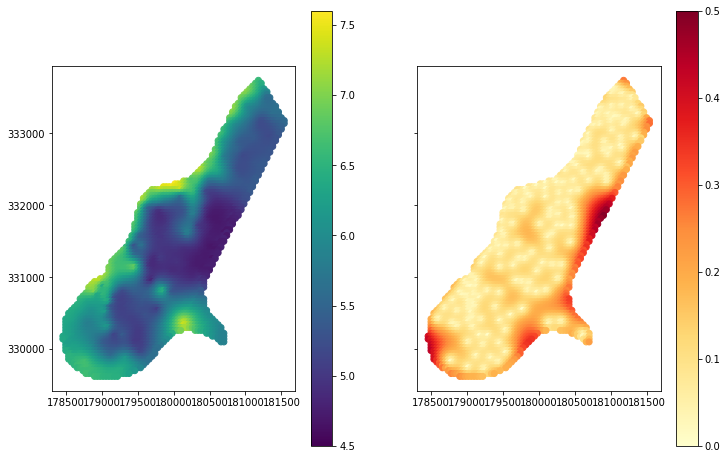

# The Deconvolution of the Aggregated Data into the Fine-Scale Blocks with Pyinterpolate

## Introduction

Do you need high-resolution data for your machine learning, but you have only areal aggregates? Would you like to present continuous maps instead of choropleth maps? We can transform county-level data into smaller blocks with Pyinterpolate. During workshops, we will learn how to perform Poisson Kriging on the areal dataset.

## Rationale - why should I use pyinterpolate?

Choropleth maps representing areal aggregates are standard in the social sciences. We aggregate data over areas for administrative purposes and protect citizens' privacy. Unfortunately, those aggregated datasets can be misleading:

- Administrative units, especially in Europe, vary significantly in shape and size,
- Large units tend to be visually more important than smaller areas,
- It is hard to integrate areal data into machine learning pipelines with data at a smaller and regular scale.

There is a solution for the processes that are spatially correlated and represent rates. One example is the disease incidence rate map. An incidence rate is the number of disease cases per area divided by the total population and multiplied by the constant number of 100,000. Through the denominator (total population), we can divide our space into smaller blocks – in this case, the population blocks. Then we regularize the semivariogram of areal data with the population density semivariogram to obtain a final model that considers fine-scale population blocks and can predict disease rates at a smaller scale. After this transformation, we can:

- show a continuous map of disease rates,
- avoid problems with the visual discrepancy between different areas' sizes,
- use data with better spatial resolution as an input for machine learning pipelines; for example, we can merge data with the remotely sensed information.

We will learn how to transform areal aggregates into smaller blocks during workshops. We will use the Pyinterpole package. We will discuss the most dangerous modeling pitfalls and what can be done with the output data. This workshop is for you if you are an expert in the economy, social sciences, public health, or similar fields.

Pyinterpolate is a Python package for spatial interpolation. It is available here: https://pypi.org/project/pyinterpolate/

What can be achieved with pyinterpolate? Look at this map:


## Setup

We will work in a `Google Colab` (GC) environment. Setup in GC is not different than a setup in Linux or macOS systems, but we'll do it step-by-step to be sure that everyone can follow.

First, **pyinterpolate** in a stable version (*0.2.5-post1*) requires Python in version `3.7.x`. It could be tricky to configure it locally, but if you use `conda` or `pipenv`, it shouldn't be a problem. GC has Python in version `3.7.13` by default, so we are ready.

As a sanity check, you may write in GC:

```shell
!python3 --version
```

and the expected output is:

```shell
>>> Python 3.7.13
```

> For the **future**, you may install different versions of Python in your Google Colab. Fortunately for us, the future stable release of **pyinterpolate** will work with Python 3.7, Python 3.8, and Python 3.9, so there won't be any problem with the installation.

It doesn't matter if you use your local environment or GC; your OS must have installed the `libspatialindex.so` package. In GC, you should type whenever a fresh run starts:

```shell
!sudo apt install libspatialindex-dev
```

Now we are sure that our system is configured correctly. We can install the package!

```shell
!pip install pyinterpolate
```

> **Pyinterpolate** depends on the packages *matplotlib* and *numpy* - you may be forced to restart the kernel after the installation in GC because those packages were included in the base setup of your environment. Just click the `RESTART RUNTIME` button, and everything should work fine! In the local environment, it shouldn't be the case.

We are ready to go!

## Datasets

We will use two different datasets:

1. `meuse` dataset [1] used for point kriging of zinc concentrations.
2. `Breast Cancer Rates in New England` [2] used for block deconvolution, `Population point-support data` [3]. Analysis based on [4].

## How Kriging works - practical PoV

Kriging is an interpolation method that allows us to find values at unseen and unsampled locations. The technique is based on the spatial process's semivariance (or covariance) model. It is similar to the Inverse Distance Weighting algorithm in that the unknown value is a weighted average of available observations. Still, contrary to IDW, Kriging weights are different at different distances. Moreover, Kriging has two essential properties:

- it generates unbiased predictions; in practice, if we "predict" values of known points, we should get the exact value,
- it returns not only regressed value but variance error too. It is a measure of interpolation uncertainty.

In practice, data analyst always follows a set of steps to make a Kriging prediction:

- create an experimental variogram of known points,
- based on the experimental variogram: model theoretical variogram model (only set of models is available for this, not every function can be applied at this step!),
- Applying the theoretical model to weights in the Kriging system.

**Pyinterpolate** simplifies those steps, but we shouldn't treat Kriging as an algorithm that can run without supervision. The critical step that humans should do is to choose a valid semivariogram model (or just approve a selected model).

Let's go through the initial example, where we will model zinc concentrations from the point measurements.

## The point Kriging example - zinc concentrations

### 1. Import Python packages

```python
import numpy as np
import pandas as PD
import geopandas as gpd

from pyinterpolate.semivariance import calculate_semivariance  # experimental semivariogram
from pyinterpolate.semivariance import TheoreticalSemivariogram  # theoretical models
from pyinterpolate.kriging import Krige
from shapely.geometry import Point

import matplotlib.pyplot as plt
```

- **numpy**: data transformations,
- **pandas**: read tabular data,
- **geopandas**: work with spatial tables,
- `calculate_semivariance`: get experimental semivariance model,
- `TheoreticalSemivariogram`: create theoretical variogram model,
- `Krige`: Kriging interpolator,
- `shapely.geometry.Point`: data transformations,
- `matplotlib.pyplot`: show intermediate steps and results.

### 2. Read data

```python
df = pd.read_csv('/content/drive/MyDrive/data_geopython_2022/meuse.csv')
```

### 3. Select columns

It can be done in the second step with `usecols` parameter of the `pandas.read_csv()` function.

```python
# Get only x, y, and zinc concentration columns

df = df[['x', 'y', 'zinc']]
```

### 4. Transform data

Take **log** of the interpolated zinc concentrations.

```python
# Transform zinc column

df['zinc'] = np.log(df['zinc'])
```

> Why did we it? Kriging doesn't work well with highly skewed data. Log-transform may be required.

### 5. Calculate experimental variogram

For this step, we must set two parameters:

- `step_size`: to control how many lags has our variogram (we should smooth variability but preserve a general trend, examples below).
- `max_range`: close points tend to be correlated, but it is rarely a case at a long distance! Usually, we should assume that the max range of spatial correlation is about half of a study extent. This is a good practice from the computational perspective because, in most cases, the weights at larger distances are too small to affect a predicted value.

**Wrong**: here we model experimental variogram with a very big step, and maximum range that exceeds the study extent:

```python
step_size = 3000
max_r = 160_000
variogram = calculate_semivariance(df.values, step_size=step, max_range=max_r)

# Plot experimental semivariogram

plt.figure(figsize=(12, 6))
plt.plot(variogram[:, 0], variogram[:, 1], '--o')
plt.title('Semivariogram')
plt.xlabel('Distance')
plt.ylabel('Semivariance')
plt.show()
```

> Why did we it? A common error is setting the wrong range and step size because we didn't check the coordinate reference system. For example, data has geographical coordinates, but we expect it to be in a metric system.

**Wrong**: too small step size.

```python
step = 20
max_r = 1600
variogram = calculate_semivariance(df.values, step_size=step, max_range=max_r)

# Plot experimental semivariogram

plt.figure(figsize=(12, 6))
plt.plot(variogram[:, 0], variogram[:, 1], '--o')
plt.title('Semivariogram')
plt.xlabel('Distance')
plt.ylabel('Semivariance')
plt.show()
```

> Why did we it? To show that too small a step generates too much noise. We are interested in the smooth trend and not a small-scale variability. However, this variogram is much better than the previous one. But we can do it better!

**Correct**:

```python
step = 100
max_r = 1600
variogram = calculate_semivariance(df.values, step_size=step, max_range=max_r)

# Plot experimental semivariogram

plt.figure(figsize=(12, 6))
plt.plot(variogram[:, 0], variogram[:, 1], '--o')
plt.title('Semivariogram')
plt.xlabel('Distance')
plt.ylabel('Semivariance')
plt.show()
```

The correct example allows us to model Theoretical Variogram.

### 6. Fit theoretical model into experimental variogram

This is the most crucial step of the analysis. We may consider it the model training in a classic Machine Learning approach. Further interpolation results are directly related to our chosen semivariogram and its parameters.

Here is a sample experimental variogram and fitted theoretical model:


Our role is to find:

- **nugget** (or bias) at a distance 0 (point with itself). Usually, it is set to 0, but for some cases, it has a value > 0.
- **sill** - the value of dissimilarity where points stop affecting each other,
- **range** - the distance when variogram reaches its sill.
- **model** - theoretical function that utilizes **nugget**, **sill** and **range** in some way. In practice, there is a limited set of functions that can be applied to semivariogram modeling, and they are known as conditional negative semi-definite functions. In practice, we cannot simply use any function to describe a variogram because it could lead to negative variances at some distances.

Models are available in version 0.2.5.post-1:

- circular,
- cubic,
- exponential,
- gaussian,
- linear,
- power,
- spherical.

The tutorial given in supplementary materials [S1] presents the comparison between models.

We will use `.find_optimal_model()` method to allow algorithm to choose for us the best **range**, **sill** and **model** (**nugget** is set to 0 at a distance 0). We pass only one parameter: `number_of_ranges`, the number of different distances tested for the lowest possible model error.

First, we initialize the model:

```python
number_of_rngs = 64


theo_pyint = TheoreticalSemivariogram(
    points_array=df.values,
    empirical_semivariance=variogram
    )
```

Then, we allow algorithm to search the best range and model for our experimental data:

```python
opt_pyint = theo_pyint.find_optimal_model(
    number_of_ranges=number_of_rngs,
    number_of_sill_ranges=number_of_rngs
    )

print(f'Optimal model is {opt_pyint}')
```

```shell
>>> Optimal model is spherical
```

We can plot semivariogram with `.show_semivariogram()` method:

```python
theo_pyint.show_semivariogram()
```

We won't spend a lot of time here during the workshops, but you should be aware that the next stable release (0.3.0) will have many methods to control semivariogram modeling, the core operation in Kriging.

### 7. Build and test the Kriging model

Kriging is not a single technique, and there are multiple methods to *Krige*. The most popular is *Ordinary Kriging*, but **pyinterpolate** also has *Simple Kriging* and *Poisson Kriging* techniques.

We use Ordinary Kriging; if you want to learn more, feel free to check supplementary materials [S2].

`Krige` object takes two parameters: semivariogram model and known points. We can check if our Kriging model works as it should with a simple test. We use one available point coordinates and predict the value at this place. If it's equal to the training value, then our model works fine!

```python
# Initialize model

model = Krige(semivariogram_model=theo_pyint, known_points=df.values)

# Get one sample for test
unknown = df.sample().values[0]
unknown_val = unknown[-1]
unknown_loc = unknown[:-1]

# Set Kriging parameters
nn = 32
nmin = 8

# Make a prediction
ok_pred = model.ordinary_kriging(unknown_location=unknown_loc,
                                 max_no_neighbors=nn)
                                 
# Compare predicted value to real observation
print(np.equal(ok_pred[0], unknown_val))
```

```shell
True
```

### 8. Make predictions

If our test returned `True,` we are free to interpolate values at unseen locations! To do so, we must pass unknown points into a model and store predictions and prediction errors.

```python
# Read point grid

data = pd.read_csv('/content/drive/MyDrive/data_geopython_2022/meuse_grid.csv')
data = data[['x', 'y']].values

# Set output array and a Krige object

interpolated_results = []

model_pyint = Krige(semivariogram_model=theo_pyint, known_points=df.values)
```

Now we can make predictions!

```python
for pt in data:
    try:
        pred, err = model_pyint.ordinary_kriging(unknown_location=pt,
                                                 max_no_neighbors=nn,
                                                 min_no_neighbors=nmin)[:2]
    except ValueError:
        pred, err = np.nan, np.nan
        
    interpolated_results.append([pt[0], pt[1], pred, err])
    
predictions = gpd.GeoDataFrame(interpolated_results,
                           columns=['x', 'y', 'pred', 'err'])

```

Voila! We have an array of predictions and an array of prediction errors. Now, we can transform `x` and `y` coordinates to `Point` and plot results on a map!


```python
predictions['geometry'] = gpd.points_from_xy(predictions['x'], predictions['y'])
predictions.set_geometry('geometry', inplace=True)

fig, axes = plt.subplots(ncols=2, sharex=True, sharey=True, figsize=(12, 8))
predictions.plot(ax=axes[0], column='pred', legend=True, vmin=4.5, vmax=7.6)
predictions.plot(ax=axes[1], column='err', cmap='YlOrRd', legend=True, vmin=0, vmax=0.5)
plt.show()
```



> Important: Kriging's "superiority" over "normal" machine learning models is its explainability - we can describe the spatial process in a term of nugget, sill, variance - and, even more critical, the variance error map that shows the uncertainty of interpolated results in a given area. For some applications, this explainability and uncertainty are crucial (public health, mining, weather forecasts).

# The block kriging example - deconvolution of choropleth map into a small-scale point-support map

The process of block deconvolution is described in [4]. It allows us to transform block rates (or volumes) into a point-support map.


**Pyinterpolate** has three algorithms used for block Kriging:

1. *Centroid-based Poisson Kriging*: used for areal interpolation and filtering. We assume that each block can collapse into its centroid. It is much faster than Area-to-Area and Area-to-Point Poisson Kriging but introduces bias related to the area's transformation into single points [S3].
2. *Area-to-Area Poisson Kriging*: used for areal interpolation and filtering. The point-support allows the algorithm to filter unreliable rates and makes the final areal representation of rates smoother [S4].
3. *Area-to-Point Poisson Kriging*: where areal support is deconvoluted regarding the point support. Output map has a spatial resolution of the point support while coherence of analysis is preserved (sum of rates is equal to the output of Area-to-Area Poisson Kriging). It is used for point-support interpolation and data filtering [S5].

During this workshop, we will explore the *Area-to-Point* technique, which requires semivariogram deconvolution from us. As you see, semivariogram analysis and modeling is, again, a significant part of our job.

### 1. Import packages and modules

```Python
import numpy as np
import pandas as pd
import geopandas as gpd

from pyinterpolate.io_ops import prepare_areal_shapefile, get_points_within_area  # Prepare data
from pyinterpolate.semivariance import calculate_semivariance  # Experimental semivariogram
from pyinterpolate.semivariance import RegularizedSemivariogram  # Semivariogram regularization class
from pyinterpolate.semivariance import TheoreticalSemivariogram
from pyinterpolate.kriging import ArealKriging

import matplotlib.pyplot as plt
```

### 2. Set paths to datasets and the names of the required columns

Area-to-Point Kriging requires two data sources:

1. Polygons (blocks) with rates are usually presented as a choropleth map.
2. Point-support data, representing the denominator of our rates. It could be a population (where we analyze the number of disease cases per population), time (where we explore the number of endangered species counts per time spent on observations in a given region), or depth (number of grade counts per depth of the sampling hole).

The algorithm must know the index and value column names of a block and the value column name of a point-support.

```python
BLOCKS = '/content/drive/MyDrive/data_geopython_2022/cancer_data.shp'
POINT_SUPPORT = '/content/drive/MyDrive/data_geopython_2022/cancer_population_base.shp'

BLOCK_ID = 'FIPS'
BLOCK_VAL_COL = 'rate'
PS_VAL_COL = 'POP10'
```

### 3. Load blocks and point support into the module

Blocks data must be preprocessed, the same for the point-support. Both data sources are transformed into numpy arrays.

Block data structure is:

```
[area_id, area_geometry, centroid coordinate x, centroid coordinate y, value]
```

Point-support structure is:

```
[area_id, [[point_position_x, point_position_y, value], ...]]
```

We get block centroids and group point support within blocks for the modeling.

```python
areal_data_prepared = prepare_areal_shapefile(BLOCKS, BLOCK_ID, BLOCK_VAL_COL)

points_in_area = get_points_within_area(BLOCKS,
                                        POINT_SUPPORT,
                                        areal_id_col_name=BLOCK_ID,
                                        points_val_col_name=PS_VAL_COL)
```

### 4. Check block data experimental variogram

Before we start modeling, we should first check a block variogram and a point-support variogram to be sure that our data has any spatial dependency (at both levels) and to find the best step size and maximum range for modeling.

First, we will check the experimental variogram of blocks - it is derived from block centroids.

```python
maximum_range = 300000
step_size = 40000

dt = areal_data_prepared[:, 2:]  # x, y, val
exp_semivar = calculate_semivariance(data=dt, step_size=step_size, max_range=maximum_range)

# Plot experimental semivariogram

plt.figure(figsize=(12, 7))
plt.plot(exp_semivar[:, 0], exp_semivar[:, 1])
plt.title('Experimental semivariogram od areal centroids')
plt.xlabel('Range - in meters')
plt.ylabel('Semivariance')
plt.show()
```


It seems to be ok so that we can make the next step: let's check population units:

```python
def build_point_array(points):
    a = None

    for rec in points:
        if a is None:
            a = rec.copy()
        else:
            a = np.vstack((a, rec))

    return a

maximum_point_range = 300000
step_size_points = 10000


pt = build_point_array(points_in_area[:, 1])  # x, y, val
exp_semivar = calculate_semivariance(data=pt, step_size=step_size_points, max_range=maximum_point_range)

# Plot experimental semivariogram

plt.figure(figsize=(12, 7))
plt.plot(exp_semivar[:, 0], exp_semivar[:, 1])
plt.title('Experimental semivariogram od population data')
plt.xlabel('Range - in meters')
plt.ylabel('Semivariance')
plt.show()
```


This variogram is fine too, but as you may have noticed, its variance is orders of magnitude larger than semivariances of block data. Our role is to transform this variogram and find the theoretical model that will describe the block's process at a point-support scale.

### Fit model

At this point, we have block data, point support, information about the step size, and the maximum range of block data. We can initialise `RegularizedSemivariogram()` model.

```python
reg_mod = RegularizedSemivariogram()
```

The first step is to fit initial variograms and check how big an error is between those. This process takes some time because we perform multiple heavy-computing operations on a set of points:

- we calculate "inner variograms" of each block,
- we calculate variograms between blocks based on the point support within a specific block.

The `.fit()` method takes 6 parameters:

1. `areal_data`: transformed block data,
2. `areal_step_size`: step size of experimental variogram of blocks data,
3. `max_areal_range`: a maximum range of an areal data.
4. `point_support_data`,
5. `weighted_lags`: if True, then the algorithm will penalize more lags at a close distance (the close neighbors are better fitted to the model),
6. `store_models`: if True, then each semivariogram model parameter is stored (we can check how those were changing).

```python
reg_mod = RegularizedSemivariogram()

reg_mod.fit(areal_data=areal_data_prepared,
            areal_step_size=step_size,
            max_areal_range=maximum_range,
            point_support_data=points_in_area,
            weighted_lags=True,
            store_models=False)
```

After fit, we can check the initial results of modeling:

```python
lags = reg_mod.experimental_semivariogram_of_areal_data[:, 0]

plt.figure(figsize=(12, 7))
plt.plot(lags, reg_mod.experimental_semivariogram_of_areal_data[:, 1], 'ob')
plt.plot(lags, reg_mod.initial_theoretical_model_of_areal_data.predict(lags), color='r', linestyle='--')
plt.plot(lags, reg_mod.initial_regularized_model, color='black', linestyle='dotted')
plt.legend(['Experimental semivariogram of areal data', 'Initial Semivariogram of areal data',
            'Regularized data points'])
plt.title('Semivariograms comparison. Deviation value: {}'.format(reg_mod.initial_deviation))
plt.xlabel('Distance')
plt.ylabel('Semivariance')
plt.show()
```


### Transform model (regularize it)

The following required step is to transform a fitted model. It is a long operation, and we will skip running a cell with the code during the workshops. We have a few parameters to control the time of process and quality of an output variogram:

- `max_iters` - how many iterations of the procedure we apply. More is not always better because gain will be negligible, and we lose time for tedious data processing.
- `min_deviation_ratio`: minimum ratio between deviation and initial deviation (D(i) / D(0)) below each algorithm is stopped.
- `min_diff_decrease`: minimum difference between new and optimal deviation divided by optimal deviation: (D(i) - D(opt)) / D(opt). If it is recorded n times (controled by the min_diff_d_stat_reps param) then algorithm is stopped,
- `min_diff_decrease_reps`: number of iterations when the algorithm is stopped if condition min_diff_d_stat is fulfilled.

```python
reg_mod.transform(max_iters=5)
```

```
lags = reg_mod.experimental_semivariogram_of_areal_data[:, 0]
plt.figure(figsize=(12, 7))
plt.plot(lags, reg_mod.experimental_semivariogram_of_areal_data[:, 1], 'bo')
plt.plot(lags, reg_mod.initial_theoretical_model_of_areal_data.predict(lags), color='r', linestyle='--')
plt.plot(lags, reg_mod.optimal_regularized_model, color='g', linestyle='-.')
plt.plot(lags, reg_mod.optimal_theoretical_model.predict(lags), color='black', linestyle='dotted')
plt.legend(['Experimental semivariogram of areal data', 
            'Initial Semivariogram of areal data',
            'Regularized data points, iteration {}'.format(reg_mod.iter),
            'Optimized theoretical point support model'])
plt.title('Semivariograms comparison. Deviation value: {}'.format(reg_mod.optimal_deviation))
plt.xlabel('Distance')
plt.ylabel('Semivariance')
plt.show()
```


### Save model output

The output we are interested in is the Theoretical Variogram model (nugget, sill, range, and model type) derived during semivariogram regularization. As you know, the process is long, so it's a good idea to store results to avoid doing it again!

```python
transformed_variogram = '/content/drive/MyDrive/data_geopython_2022/transformed_variogram'

reg_mod.export_regularized_model(transformed_variogram)
```

We can import this model to `TheoreticalSemivariogram` model:

```python
variogram = TheoreticalSemivariogram()
variogram.import_model(transformed_variogram)
```

### Perform Poisson Kriging

The last step is to perform areal kriging. We can do it with the `ArealKriging` class. It allows us to perform Area-to-Area or Area-to-Point Kriging. We will do the latter:

```python
number_of_obs = 8
radius = 30000

# Get CRS

gdf_crs = gpd.read_file(BLOCKS).crs

kriging_model = ArealKriging(
    semivariogram_model=variogram,
    known_areas=areal_data_prepared,
    known_areas_points=points_in_area,
    kriging_type='atp')

smoothed_area = kriging_model.regularize_data(number_of_neighbours=number_of_obs,
                                              max_search_radius=radius,
                                              data_crs=gdf_crs)
```

We pass similar parameters to Ordinary Kriging, e.g., number of neighbors and max search radius. Additionally, we are supposed to pass data CRS. Output is a GeoDataFrame; we can plot it and check the results:

```python
fs = (14, 10)
output_map = smoothed_area.copy()

output_map.plot(column='reg.est', cmap='Purples', legend=True, figsize=fs, markersize=2*np.sqrt(output_map['reg.est']), vmin=0, vmax=100)
```


### ?

**Congratulations!** We have reached the end of the tutorial. Now it's your turn!

## Materials and Notebooks

Pyinterpolate package: https://github.com/DataverseLabs/pyinterpolate

Area-to-Point Kriging Notebook: https://colab.research.google.com/drive/17AuhRkNMGJYuM2L1Xe2sZRZX6hnBvoVp?usp=sharing

Ordinary Kriging Notebook: https://colab.research.google.com/drive/1HfdJmX73LvumPHR1jpu38TJO1iJ62C9Q?usp=sharing

Datasets used in the analysis: https://drive.google.com/drive/folders/1p4xPTCNYVWNvt9LakRih6FqzLzRydD7s?usp=sharing

All notebooks and datasets are available in the repository: https://github.com/DataverseLabs/pyinterpolate-conference-materials/tree/main/2022/geopython/data

## Bibliography

[1] Pebesma, E. The meuse data set: a tutorial for the gstat R package. URL: [here](https://cran.r-project.org/web/packages/gstat/vignettes/gstat.pdf)

[2] National Cancer Institute. Incidence Rates Table: Breast Cancer: United States. URL: [here](https://www.statecancerprofiles.cancer.gov/incidencerates/index.php?stateFIPS=00&areatype=county&cancer=055&race=00&sex=2&age=001&stage=999&year=0&type=incd&sortVariableName=rate&sortOrder=default&output=0#results)

[3] United States Census Bureau. Centers of Population for the 2010 Census. URL: [here](https://www.census.gov/geographies/mapping-files/time-series/geo/tiger-line-file.2010.html)

[4] Goovaerts, P. Kriging and Semivariogram Deconvolution in the Presence of Irregular Geographical Units. Mathematical Geosciences, volume 40, year 2007. DOI: 10.1007/s11004-007-9129-1

## Supplementary Materials

[S1] [Fit semivariogram](https://github.com/DataverseLabs/pyinterpolate/blob/main/tutorials/Semivariogram%20Estimation%20(Basic).ipynb
)

[S2] [Comparison of Ordinary and Simple Kriging](https://github.com/DataverseLabs/pyinterpolate/blob/main/tutorials/Ordinary%20and%20Simple%20Kriging%20(Basic).ipynb)

[S3] [Poisson Kriging - centroid based approach - tutorial](https://github.com/DataverseLabs/pyinterpolate/blob/main/tutorials/Poisson%20Kriging%20-%20Centroid%20Based%20(Advanced).ipynb)

[S4] [Poisson Kriging - Area to Area Kriging](https://github.com/DataverseLabs/pyinterpolate/blob/main/tutorials/Poisson%20Kriging%20-%20Area%20to%20Area%20(Advanced).ipynb)

[S5] [Poisson Kriging - Area to Point Kriging](https://github.com/DataverseLabs/pyinterpolate/blob/main/tutorials/Poisson%20Kriging%20-%20Area%20to%20Point%20(Advanced).ipynb)


